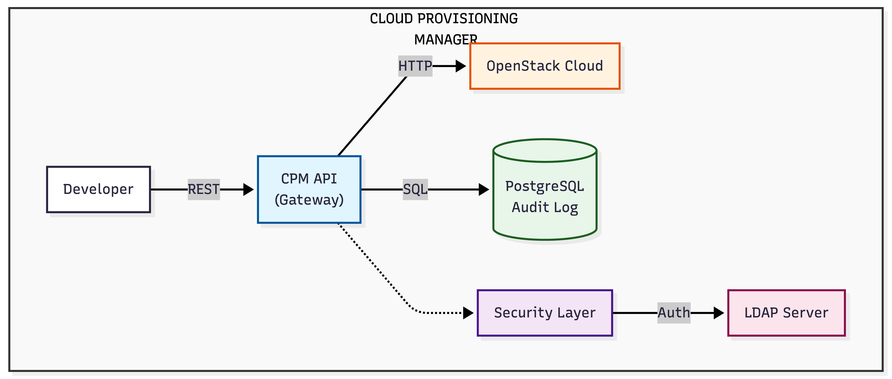
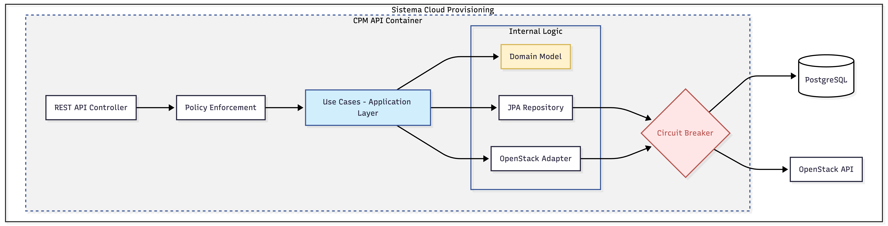
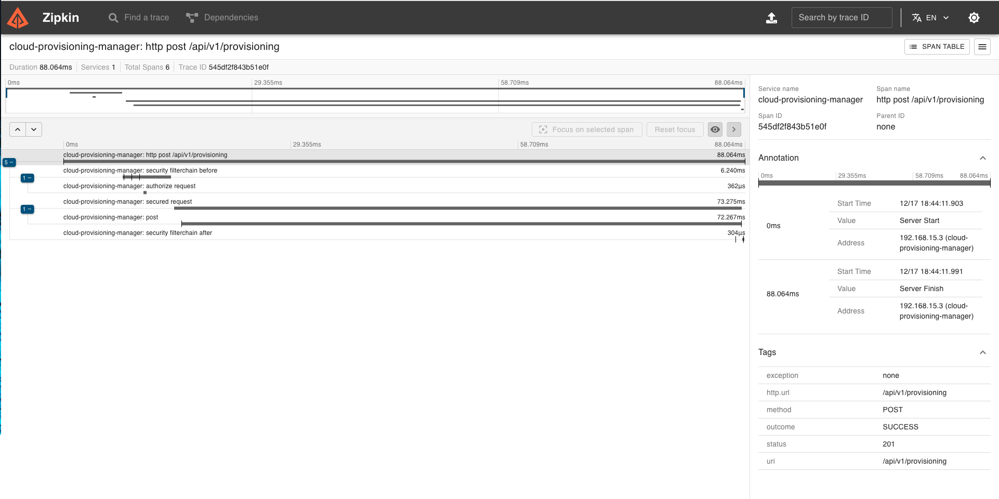

# Cloud Provisioning Manager (CPM)


[](https://github.com/eziocdl/cloud-provisioning-manager/actions/workflows/ci.yml)
[](https://codecov.io/gh/eziocdl/cloud-provisioning-manager)

> Governance and Orchestration API for cloud infrastructure provisioning.

---

## Highlights

| Feature | Description |
|---------|-------------|
| **Clean Architecture** | Clear separation of concerns with Ports & Adapters |
| **Domain-Driven Design** | Aggregates, Value Objects, Domain Events, Domain Services |
| **Circuit Breaker** | Resilience with automatic fallback via Resilience4j |
| **Distributed Tracing** | End-to-end observability with Zipkin |
| **LDAP Auth** | Corporate authentication with roles (TRAINEE, DEV, ADMIN) |
| **Kubernetes Ready** | Deployment, Service, ConfigMap, Secrets |
| **Architecture Tests** | Automated validation with ArchUnit |
| **Code Coverage** | JaCoCo reports integrated with CI |

---

## The Problem

Large enterprises suffer from **Shadow IT** and financial chaos in the cloud. Developers create VMs without standardization, without cost tags, and without approval, generating million-dollar bills and security breaches.

## The Solution

CPM acts as an **Intelligent Gateway** between developers and infrastructure (OpenStack):

1. **Security Shield**: Access via corporate LDAP
2. **Active Governance**: Business rules by role (e.g., "Trainee can only create small VMs")
3. **Resilience**: Circuit Breaker for fault tolerance
4. **Observability**: Distributed Tracing with Zipkin

---

## C4 Architecture

### Context Diagram

High-level view of the system showing external actors and integrations.



### Container Diagram

Internal flow showing the application components and Circuit Breaker pattern.



### Component Diagram (Clean Architecture)

Detailed view of the Clean Architecture layers with Ports & Adapters pattern.


---

## Tech Stack

| Category | Technology |
|----------|------------|
| Runtime | Java 21 + Spring Boot 4.0 |
| Persistence | PostgreSQL + Spring Data JPA + Flyway |
| Security | Spring Security + LDAP |
| Resilience | Resilience4j (Circuit Breaker) |
| Observability | Micrometer + Zipkin (Distributed Tracing) |
| Containerization | Docker + Kubernetes |
| Documentation | OpenAPI 3.0 (Swagger) |
| Testing | JUnit 5 + Testcontainers |

---

## Getting Started

### Prerequisites

- Java 21+
- Docker & Docker Compose
- Maven 3.9+

### 1. Start Infrastructure

```bash
docker-compose up -d
```

This starts:
- PostgreSQL (port 5432)
- OpenLDAP (port 389)
- Zipkin (port 9411)
- WireMock - OpenStack Mock (port 8081)

### 2. Run the Application

```bash
./mvnw spring-boot:run
```

### 3. Access

- **Swagger UI**: http://localhost:8080/swagger-ui.html
- **Zipkin**: http://localhost:9411

---

## API Endpoints

### POST /api/v1/provisioning

Creates a VM provisioning request.

**Request:**
```json
{
  "username": "devuser",
  "ram": "16GB",
  "cpu": "4vCPU"
}
```

**Response (201 Created):**
```json
{
  "id": "550e8400-e29b-41d4-a716-446655440000",
  "status": "PENDING_APPROVAL",
  "trackingId": "550e8400-e29b-41d4-a716-446655440000"
}
```

**Response (403 Forbidden - Policy Violation):**
```json
{
  "type": "https://cpm.org/errors/policy-violation",
  "title": "Policy Violation",
  "status": 403,
  "detail": "Policy violation: User with role 'TRAINEE' cannot request RAM=64GB. Maximum allowed: 8GB",
  "userRole": "TRAINEE",
  "violatedResource": "RAM",
  "requestedValue": "64GB",
  "maxAllowed": "8GB"
}
```

---

## Governance Policies

| Role | Max RAM | Max CPU |
|------|---------|---------|
| TRAINEE | 8GB | 4 vCPU |
| DEV | 32GB | 8 vCPU |
| ADMIN | Unlimited | Unlimited |

---

## Test Users (LDAP)

| Username | Password | Role |
|----------|----------|------|
| admin | senhaadmin123 | ADMIN |
| devuser | senhadev123 | DEV |
| trainee | senhatrainee123 | TRAINEE |

---

## Testing

```bash
# All tests
./mvnw test

# Unit tests only
./mvnw test -Dtest=*Test

# Integration tests (requires Docker)
./mvnw failsafe:integration-test failsafe:verify
```

---

## Kubernetes Deployment

```bash
# Apply manifests
kubectl apply -f k8s/

# Check pods
kubectl get pods -l app=cpm
```

---

## Project Structure

```
src/
├── main/java/com/eziocdl/
│   ├── api/                    # Controllers, DTOs, Exception Handlers
│   ├── application/            # Use Cases, Ports, Event Listeners
│   ├── domain/                 # Entities, Value Objects, Domain Services
│   └── infrastructure/         # Adapters, Configs, External Integrations
└── test/java/com/eziocdl/
    ├── architecture/           # ArchUnit Tests (Clean Architecture validation)
    ├── domain/                 # Unit Tests
    └── integration/            # Integration Tests (Testcontainers)
```

---

## Documentation

| Document | Description |
|----------|-------------|
| [C4 Diagrams](docs/architecture/C4-DIAGRAMS.md) | Architecture diagrams (Context, Container, Component) |
| [Code Review](docs/CODE-REVIEW.md) | Technical analysis and improvement points |
| [ADR-0001](docs/adr/0001-use-clean-architecture.md) | Why Clean Architecture? |
| [ADR-0002](docs/adr/0002-use-ldap-authentication.md) | Why LDAP? |
| [ADR-0003](docs/adr/0003-use-circuit-breaker.md) | Why Circuit Breaker? |
| [ADR-0004](docs/adr/0004-use-event-driven-async.md) | Why async processing? |
| [ADR-0005](docs/adr/0005-use-distributed-tracing.md) | Why Distributed Tracing? |

---

## CI/CD

The project includes a complete GitHub Actions pipeline:

```yaml
# .github/workflows/ci.yml
- Unit Tests + Coverage (JaCoCo)
- Architecture Tests (ArchUnit)
- Integration Tests (Testcontainers)
- Build & Package
- Docker Build & Push
- Security Scan (OWASP)
- SonarCloud Analysis
```

To enable, configure secrets in GitHub:
- `CODECOV_TOKEN` - For coverage upload
- `DOCKER_USERNAME` / `DOCKER_PASSWORD` - For image push
- `SONAR_TOKEN` - For quality analysis

---

## License

MIT License - Ezio Lima

---

## Demo & Screenshots

### Swagger UI

https://github.com/eziocdl/cloud-provisioning-manager/raw/main/docs/assets/videos/swagger-demo.mp4

[Click here to watch the Swagger UI demo](docs/assets/videos/swagger-demo.mp4)

### Zipkin Distributed Tracing


